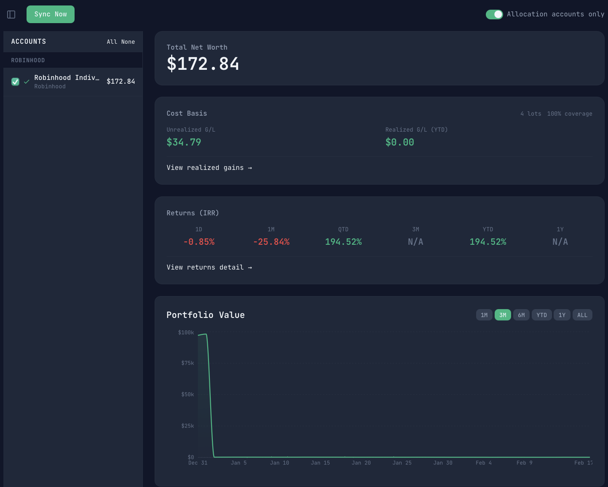

<div align="center">
  <picture>
    <source media="(prefers-color-scheme: dark)" srcset="docs/assets/logo-dark.png">
    <source media="(prefers-color-scheme: light)" srcset="docs/assets/logo-light.png">
    
  </picture>
  <p><strong>Sovereign financial architecture.</strong></p>
  <p>Your data, your schema, your future.</p>

  [](https://github.com/bobwilkinson20/tenet-folio/actions/workflows/ci.yml)
  [](LICENSE)
  [](https://www.python.org/)
  [](https://nodejs.org/)
</div>

A personal portfolio tracking application that syncs with brokerage accounts via multiple data providers (SnapTrade, SimpleFIN, Interactive Brokers, Coinbase, and Charles Schwab) to display holdings, track asset allocation, and monitor net worth over time. Market data is sourced from Yahoo Finance and CoinGecko.

<div align="center">
  
  <br><br>
  
</div>

## Prerequisites

- **Python 3.13+**
- **[uv](https://docs.astral.sh/uv/)** (Python package manager): `curl -LsSf https://astral.sh/uv/install.sh | sh`
- **Node.js 20+** (LTS)
- **npm 10+**
- **At least one brokerage provider** — all are optional; configure whichever you use (see [Configuration](#configuration))

## Quick Start

### 1. Clone and Setup

```bash
git clone https://github.com/bobwilkinson20/tenet-folio.git
cd tenet-folio

# Copy environment template and configure
cp backend/.env.example backend/.env
# Edit backend/.env with your settings (see Configuration below)

# Install all dependencies and apply migrations
make setup
```

### 2. Start Development Servers

```bash
make dev
```

This starts both the backend (`localhost:8000`) and frontend (`localhost:5173`) concurrently. Press Ctrl-C to stop both.

### 3. Configure a Brokerage Provider

Before syncing data, run the setup script for at least one provider. See [Brokerage Provider Setup](#brokerage-provider-setup) below.

## Configuration

### Backend Environment Variables

Copy `backend/.env.example` to `backend/.env` and configure:

```bash
# Database (SQLite by default)
DATABASE_URL=sqlite:///./portfolio.db

# App settings
ENVIRONMENT=development
DEBUG=true
```

### Brokerage Provider Setup

Configure one or more providers. Each has a one-time setup script that validates credentials and stores them securely (macOS Keychain preferred, `.env` fallback).

| Provider | Setup Command | Prerequisites |
|----------|--------------|---------------|
| **SnapTrade** | `uv run python scripts/setup_snaptrade.py` | [Developer account](https://snaptrade.com) |
| **SimpleFIN** | `uv run python scripts/setup_simplefin.py` | [Setup token](https://beta-bridge.simplefin.org/) |
| **Interactive Brokers** | `uv run python scripts/setup_ibkr.py` | Flex Token + Query ID from Client Portal |
| **Coinbase** | `uv run python scripts/setup_coinbase.py` | [CDP API key](https://portal.cdp.coinbase.com/projects/api-keys) (ECDSA algorithm) |
| **Charles Schwab** | `uv run python scripts/setup_schwab.py` | [Developer app](https://developer.schwab.com/) (requires manual approval by Schwab — may take several days) |

All setup commands run from `backend/`. See [CLAUDE.md](CLAUDE.md) for detailed setup instructions per provider.

## Development

### Makefile Commands

A root-level Makefile wraps common workflows so you can run everything from the project root:

| Command | Description |
|---------|-------------|
| `make setup` | Install all dependencies and apply database migrations |
| `make dev` | Run backend and frontend dev servers concurrently |
| `make test` | Run all backend and frontend tests |
| `make lint` | Run all linters and type checks |
| `make format` | Auto-format backend code |
| `make migrate` | Apply pending database migrations |
| `make migration msg="description"` | Create a new Alembic migration |

### Running Tests

```bash
make test                            # Run all tests (backend + frontend)

# Or run separately:
cd backend && uv run pytest          # Backend only
cd frontend && npm run test          # Frontend only
```

### Code Quality

```bash
make lint                            # Run all linters + type-check
make format                          # Auto-format backend code

# Or run separately:
cd backend && uv run ruff check .    # Backend lint
cd frontend && npm run lint          # Frontend lint
cd frontend && npm run build         # Type check + build
```

### Database Migrations

```bash
make migrate                                         # Apply pending migrations
make migration msg="description of changes"          # Create a new migration

# Rollback one migration
cd backend && uv run alembic downgrade -1
```

## Project Structure

```
tenet-folio/
├── backend/                  # FastAPI backend (Python)
│   ├── main.py              # App entry point
│   ├── config.py            # Settings management
│   ├── database.py          # SQLAlchemy setup
│   ├── models/              # Database models
│   ├── schemas/             # Pydantic schemas
│   ├── services/            # Business logic
│   ├── api/                 # Route handlers
│   ├── integrations/        # External API clients
│   ├── alembic/             # Database migrations
│   └── tests/               # Test suite
│
├── frontend/                 # React frontend (TypeScript)
│   ├── src/
│   │   ├── api/             # API client
│   │   ├── types/           # TypeScript types
│   │   ├── components/      # UI components
│   │   ├── pages/           # Page components
│   │   ├── hooks/           # Custom hooks
│   │   ├── context/         # React context
│   │   └── utils/           # Utilities
│   └── __tests__/           # Test suite
│
└── docs/                     # Documentation
    ├── ARCHITECTURE.md      # System architecture and design
    └── sync-and-valuation.md
```

## API Documentation

When the backend is running, visit:
- **Swagger UI:** `http://localhost:8000/docs`
- **ReDoc:** `http://localhost:8000/redoc`

## Tech Stack

**Backend:**
- FastAPI (web framework)
- SQLAlchemy (ORM)
- Alembic (migrations)
- SQLite (database)
- Pydantic (validation)

**Brokerage Integrations:**
- SnapTrade SDK
- SimpleFIN
- Interactive Brokers (Flex Web Service)
- Coinbase (Advanced Trade API)
- Charles Schwab (schwab-py)

**Market Data:**
- Yahoo Finance (yfinance)
- CoinGecko (fallback for crypto)

**Frontend:**
- React 19
- TypeScript
- Vite (build tool)
- Tailwind CSS v4
- Axios (HTTP client)
- React Router
- Vitest (testing)

## Contributing

Contributions are welcome! Please see [CONTRIBUTING.md](CONTRIBUTING.md) for guidelines on development setup, branching, testing, and the PR process.

## Security

To report a security vulnerability, please see [SECURITY.md](SECURITY.md) for responsible disclosure instructions.

## License

This project is licensed under the MIT License. See [LICENSE](LICENSE) for details.
